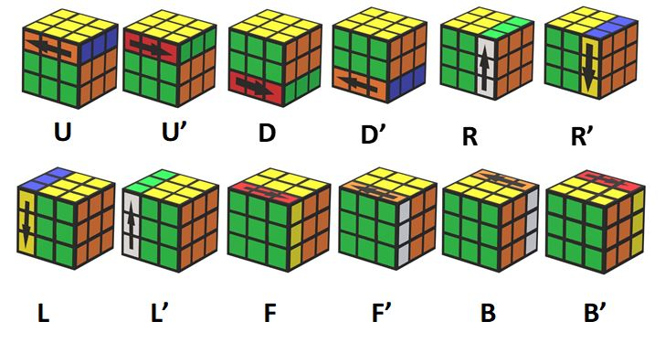
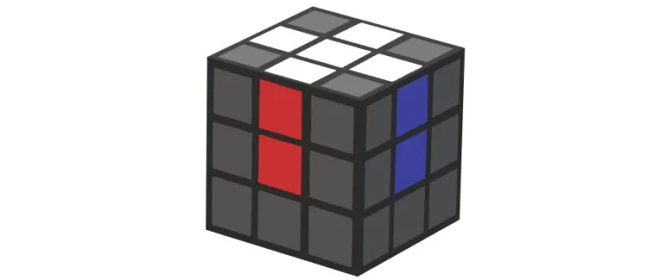
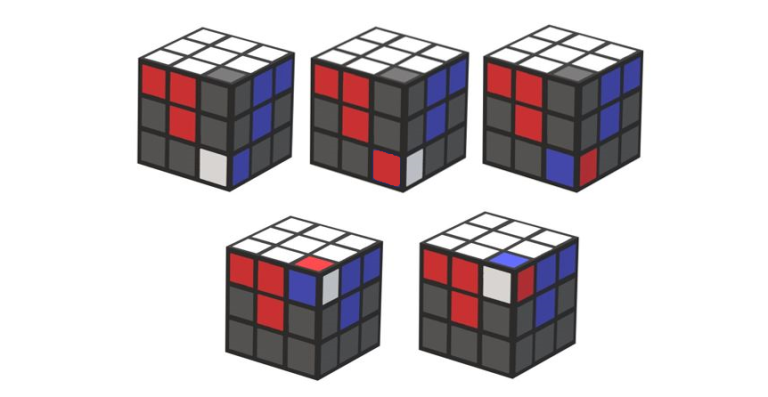
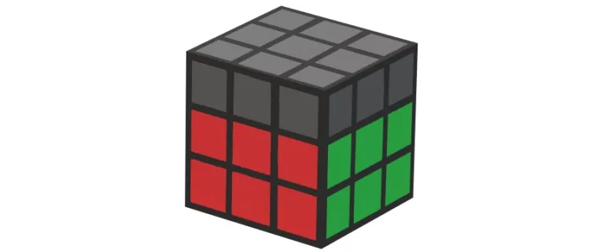
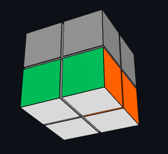
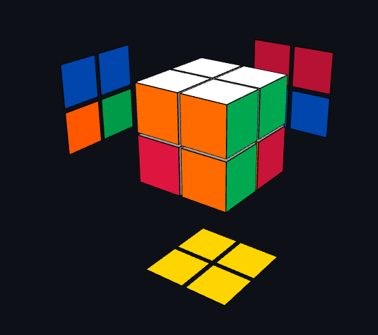
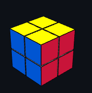

<div align="center">

# 🧩 Ultimate Rubik's Cube Guide Hub

### Interactive 3D solving guides for every twisty puzzle — 2×2 to 5×5, plus the Pyraminx.

<p>
  
  
  
  
  
</p>

<p>
  
  
  
  
  
</p>

**🌐 [Live Demo →](https://aa-gamerz22.github.io/AA-Rubik-s-Cube-Guide/)**

</div>

---

## 📖 Table of Contents

- [About](#-about)
- [Puzzle Status](#-puzzle-status)
- [Key Features](#-key-features)
- [Screenshots](#-screenshots--guide-visuals)
- [Folder Structure](#-folder-structure)
- [Quick Start](#-quick-start)
- [Tech Stack](#-tech-stack)
- [Roadmap](#-roadmap)
- [Contributing](#-contributing)
- [License](#-license)

---

## 🎯 About

A collection of **beginner-friendly, interactive 3D web guides** for solving every popular twisty puzzle — starting from the 2×2 Pocket Cube all the way up to the 5×5 Professor's Cube, plus the Pyraminx. Every guide ships with a **real, drag-to-turn 3D cube** (not static diagrams), step-by-step algorithms you can watch play out in 3D, a speedcubing timer, a knowledge quiz, and support for **English, Roman Urdu, and Urdu (اردو)**.

Open `index.html` in any browser — no build tools, no npm install, no server required.

---

## 🧩 Puzzle Status

| Puzzle | Method | Status | Path |
|---|---|:---:|---|
| 🔲 **2×2** Pocket Cube — Beginner | Corners-first | ✅ **Ready** | [`/2x2/index.html`](./2x2/index.html) |
| ⚡ **2×2** Pocket Cube — Speedcubing | Ortega (Color Neutral + OLL + PBL) | ✅ **Ready** | [`/2x2/speedcubing.html`](./2x2/speedcubing.html) |
| 🧩 **3×3** Classic Cube | Beginner Layer-by-Layer | ✅ **Ready** | [`/3x3`](./3x3) |
| 🟪 **4×4** Rubik's Revenge | Reduction + Parity | 🚧 Coming Soon | [`/4x4`](./4x4) |
| 🟥 **5×5** Professor's Cube | Reduction | 🚧 Coming Soon | [`/5x5`](./5x5) |
| 🔺 **Pyraminx** | Layer-by-Layer | 🚧 Coming Soon | [`/pyramid`](./pyramid) |

> The 2×2 (both methods) and 3×3 guides are fully built and ready to use today. The remaining puzzles have a placeholder "coming soon" page already wired into the hub navigation, and will be filled in one at a time.

---

## ✨ Key Features

Every ready guide in this hub includes:

- 🎮 **Interactive 3D Cube (Three.js)** — drag any sticker to turn that layer yourself, or drag empty space to orbit the view. It's a real, playable cube, not a picture.
- 🎥 **Live Algorithm Playback** — click any formula and watch it play out on its own 3D cube inside a popup, from 3 angles, at a controllable speed.
- 📚 **Step-by-Step Layer Guide** — every stage explained with annotated images and clean move notation.
- 📋 **One-Click Copy** — copy any algorithm straight to your clipboard.
- 🔊 **Text-to-Speech** — hear any algorithm's moves read out loud.
- ⏱️ **Speedcubing Timer** — spacebar start/stop, lap history, best time and rolling average.
- 🧠 **Interactive Quiz** — test your notation and method knowledge.
- 🌐 **3 Languages** — English, Roman Urdu, and اردو with full RTL support.
- 🎨 **4 Themes** — Dark, Light, Ocean, and Sunset.
- 🔍 **Search** — jump straight to any step, notation, or algorithm.
- 💾 **Remembers You** — theme, language, timer history, and progress are saved locally in your browser.
- 📱 **Fully Responsive** — built and tested for phones, tablets, and desktops.

---

## 📷 Screenshots & Guide Visuals

<p align="center">
  <b>Rubik's Cube Notations & Basic Moves</b><br>
  
</p>

<p align="center">
  
  
  
</p>

<p align="center">
  <b>2×2 Pocket Cube — First Layer & Solved</b><br>
  
  
  
</p>

---

## 🗂 Folder Structure

Each puzzle is fully self-contained in its own folder — an `index.html` plus an `img/` folder of the pictures it needs. The 2×2 folder holds two complete guides (Beginner + Speedcubing) that share the same `img/` folder.

```text
AA-Rubik-s-Cube-Guide/
│
├── index.html                 ← 🏠 Hub page — pick your puzzle
├── README.md
├── LICENSE
├── unnamed.png                ← favicon (also copied into each puzzle folder)
├── googlea1ccdf22a10ac631.html  ← Google Search Console verification
│
├── 2x2/
│   ├── index.html             ✅ Beginner method guide
│   ├── speedcubing.html       ✅ Ortega speedcubing guide
│   └── img/
│       ├── first-corner.png
│       ├── white-corner.png
│       ├── first-layer.png
│       ├── yellow-corner.png
│       ├── yellow-face.png
│       ├── corner-1.png ... corner-5.png     (PBL cases)
│       ├── condition-1.png ... condition-8.png  (OLL cases)
│       └── solve.png
│
├── 3x3/
│   ├── index.html         ✅ full interactive guide
│   └── img/
│       ├── cube-move.jpg
│       ├── white-cross.webp
│       ├── face-1-main.png
│       └── ... (all 3×3 guide images)
│
├── 4x4/
│   ├── index.html         (coming soon)
│   └── img/
│
├── 5x5/
│   ├── index.html         (coming soon)
│   └── img/
│
└── pyramid/
    ├── index.html         (coming soon)
    └── img/
```

---

## ⚡ Quick Start

### Option 1 — Live Demo (no setup)
👉 **[aa-gamerz22.github.io/AA-Rubik-s-Cube-Guide](https://aa-gamerz22.github.io/AA-Rubik-s-Cube-Guide/)**

### Option 2 — Run Locally
```bash
git clone https://github.com/AA-Gamerz22/AA-Rubik-s-Cube-Guide.git
cd AA-Rubik-s-Cube-Guide
```
Then just **open `index.html`** in your browser — that's it, no build step, no dependencies to install.

To jump straight into the 3×3 guide: open `3x3/index.html` directly.

### Option 3 — Host it yourself
Every folder is static HTML/CSS/JS, so this repo works as-is on GitHub Pages, Netlify, Vercel, or any static file host.

---

## 🛠 Tech Stack

| Layer | Tool |
|---|---|
| 3D rendering | [Three.js](https://threejs.org/) (r128, loaded via CDN) |
| Language | Vanilla JavaScript (ES6+) — no framework, no build step |
| Styling | Hand-written CSS3 (custom properties, glassmorphism, grid/flex) |
| Fonts | Poppins, Fira Code, Noto Nastaliq Urdu (Google Fonts) |
| Persistence | `localStorage` (theme, language, timer history, progress) |
| Hosting | GitHub Pages |

---

## 🗺 Roadmap

- [x] 3×3 guide — 3D cube, algorithms, timer, quiz, 3 languages, 4 themes
- [x] 2×2 Beginner guide — 3D cube, algorithms, timer, quiz, 3 languages, 4 themes
- [x] 2×2 Speedcubing guide (Ortega: color-neutral + 8 OLL + 5 PBL)
- [x] Multi-puzzle hub page with live preview images
- [x] Shared theme/language preference across all puzzle pages (localStorage)
- [ ] 4×4 Rubik's Revenge guide (reduction + parity)
- [ ] 5×5 Professor's Cube guide
- [ ] Pyraminx guide

---

## 🤝 Contributing

Contributions, corrections, and new puzzle guides are welcome!

1. Fork the repo
2. Create a branch: `git checkout -b feature/2x2-guide`
3. Commit your changes: `git commit -m "Add 2x2 guide"`
4. Push and open a Pull Request

If you spot a wrong algorithm, a typo, or a translation issue — please open an issue.

---

## 📄 License

Released under the **MIT License** — free to use, modify, and share.

<div align="center">

Made with ♥ for cubers everywhere — practice daily, solve happily! 🧩

</div>
